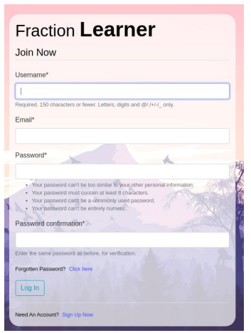
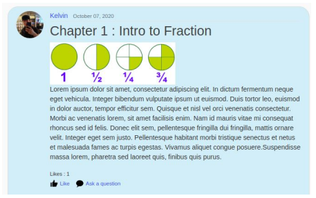
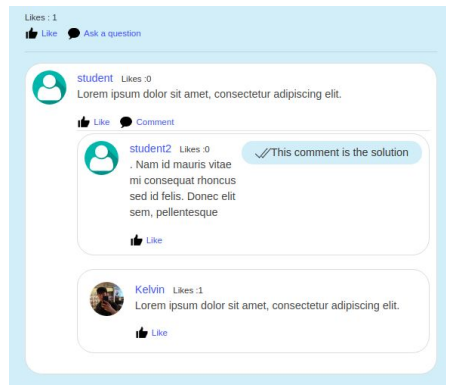

# FractionLearner
A simple django app based Fraction Learning System for School

For more info, can refer to the documentation pdf file in the reference folder

# How to start the app?
To start this app locally, please follow the following steps
1. Clone this repo
2. Create an virtual env and pip install requirements.txt
3. Navigate into mondayblur folder, run the manage.py file with the command python manage.py runserver

# Sample images of this app

